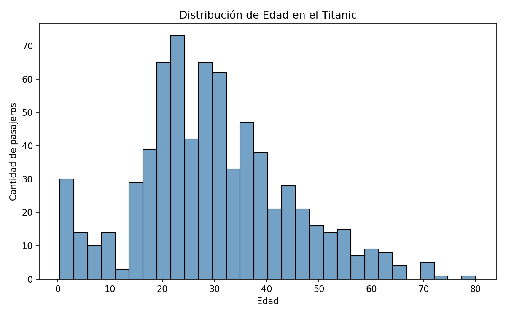
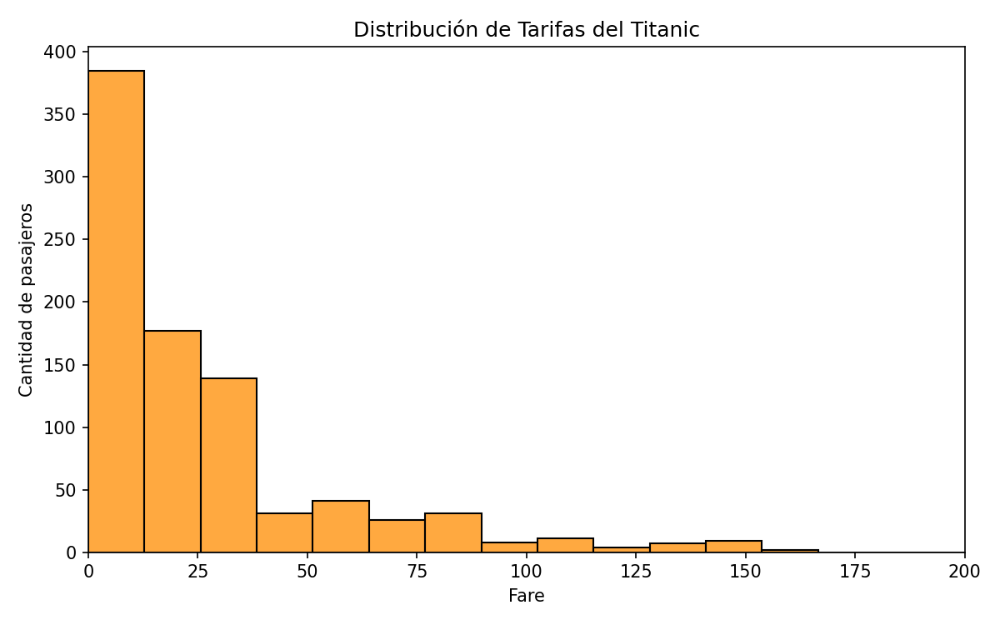
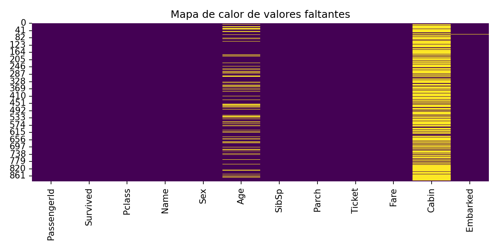
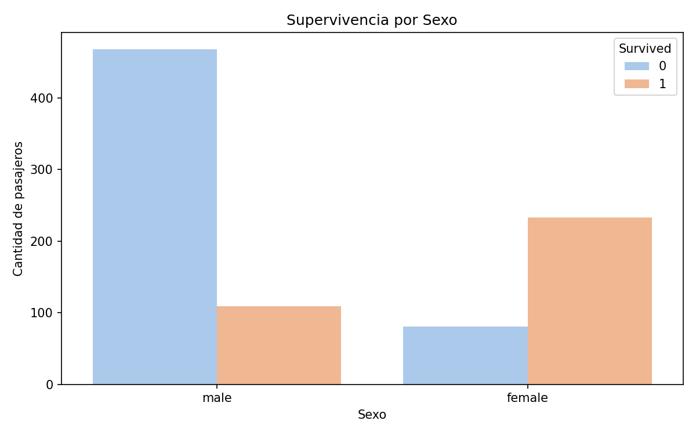
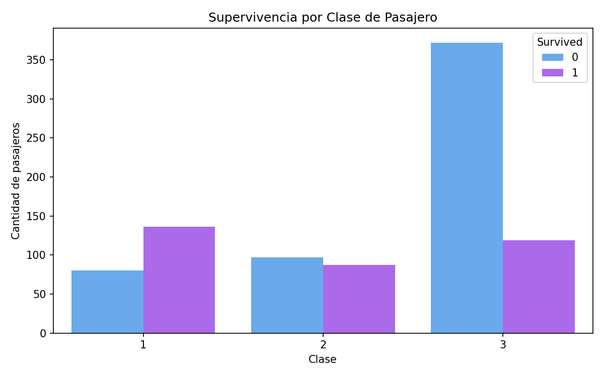
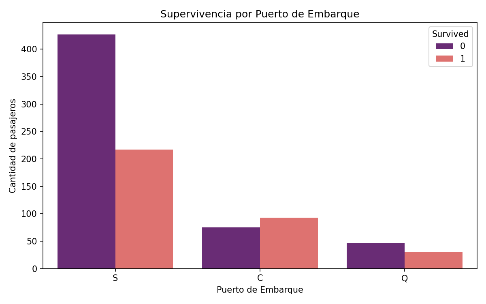
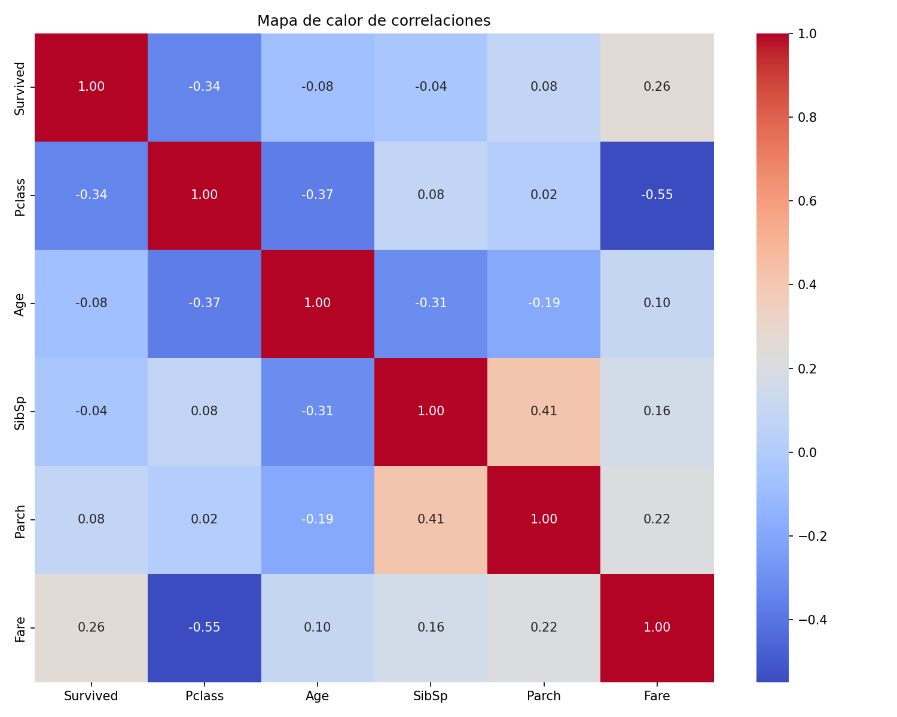

# Predicción de Supervivencia en el Titanic - Machine Learning

## 📋 Descripción del Proyecto

Este proyecto analiza el dataset del Titanic para predecir la supervivencia de pasajeros usando modelos de clasificación.
Se realiza una limpieza de datos, transformación de características, entrenamiento de modelos y evaluación con métricas reales.

El flujo del proyecto incluye:
- Carga y exploración del dataset
- Identificación y tratamiento de valores faltantes
- Transformación de variables categóricas
- Entrenamiento y comparación de modelos de clasificación
- Generación de predicciones finales en `submission.csv`

---

## 🎯 Objetivo

Construir un modelo que prediga si un pasajero habría sobrevivido o no usando los datos disponibles de entrenamiento.

---

## 📊 Datasets Utilizados

### Archivos principales:
- `train.csv` - Datos de entrenamiento (891 registros)
- `test.csv` - Datos de prueba (418 registros)
- `gender_submission.csv` - Plantilla de referencia para la entrega en Kaggle
- `submission.csv` - Predicciones generadas por el proyecto

### Resumen de dimensiones:
- `train.csv`: 891 filas, 12 columnas
- `test.csv`: 418 filas, 11 columnas
- `submission.csv`: 418 filas, 2 columnas

### Variables clave:
- `PassengerId`: ID del pasajero
- `Survived`: 0 = No sobrevivió, 1 = Sobrevivió
- `Pclass`: Clase del pasajero
- `Sex`: Sexo del pasajero
- `Age`: Edad
- `SibSp`: Hermanos/esposos a bordo
- `Parch`: Padres/hijos a bordo
- `Fare`: Tarifa pagada
- `Embarked`: Puerto de embarque

---

## 🔧 Procesamiento de Datos

### 1. Carga y limpieza inicial
- Se carga el dataset de entrenamiento con pandas.
- Se identifica que hay valores faltantes en varias columnas:
  - `Age`: 177 valores faltantes
  - `Cabin`: 687 valores faltantes
  - `Embarked`: 2 valores faltantes

### 2. Tratamiento de valores faltantes
- `Age` se rellena con 0
- `Cabin` se rellena con 0 y luego se elimina porque tiene demasiados datos faltantes
- `Embarked` se rellena con 0

### 3. Eliminación de columnas irrelevantes
Se eliminan columnas que no contribuyen a la predicción directa:
- `Name`
- `PassengerId`
- `Ticket`
- `Cabin`

### 4. Codificación de variables categóricas
- `Sex`: female → 0, male → 1
- `Embarked`: se descompone en tres variables binarias:
  - `Embarked_S`
  - `Embarked_Q`
  - `Embarked_C`

### 5. Selección de características finales
Las características usadas por los modelos son:
- `Pclass`
- `Age`
- `SibSp`
- `Parch`
- `Fare`
- `Embarked_S`
- `Embarked_Q`
- `Embarked_C`

---

## 📈 Gráficos Generados y su Interpretación

Los gráficos generados se guardan en `figures/` y explican la distribución de datos, los valores faltantes y las relaciones clave del dataset.

### 1. Distribución de Edad

- La mayoría de los pasajeros tenía entre 20 y 40 años.
- Hay pocos niños y un pequeño grupo de personas mayores.
- Esta distribución ayuda a entender cómo la edad puede influir en la supervivencia.

### 2. Distribución de Tarifas

- La tarifa es muy asimétrica, con muchos montos bajos y algunos valores extremos altos.
- Los valores altos suelen corresponder a pasajeros de primera clase.
- Por eso se normaliza la tarifa antes de entrenar los modelos.

### 3. Mapa de calor de valores faltantes

- `Cabin` es la columna con más datos faltantes.
- `Age` y `Embarked` también tienen datos ausentes.
- Esta visualización justifica la imputación y la eliminación de columnas.

### 4. Supervivencia por Sexo

- Las mujeres muestran una tasa de supervivencia mucho mayor que los hombres.
- Esta diferencia es uno de los patrones más fuertes del dataset.
- El sexo es una variable predictiva clave.

### 5. Supervivencia por Clase

- Los pasajeros de primera clase sobreviven con mayor frecuencia.
- La clase económica tiene la menor tasa de supervivencia.
- Esto confirma que la clase social influye en la probabilidad de sobrevivir.

### 6. Supervivencia por Puerto de Embarque

- Hay diferencias en supervivencia según el puerto de embarque.
- Aporto información adicional que puede colaborar con otras variables.
- Se usa junto con `Sex` y `Pclass` para caracterizar mejor a los pasajeros.

### 7. Mapa de calor de correlaciones

- Muestra cómo se relacionan `Survived`, `Pclass`, `Age`, `SibSp`, `Parch` y `Fare`.
- `Fare` y `Pclass` están correlacionados con la supervivencia.
- Esta gráfica ayuda a identificar variables que aportan más señal al modelo.

---

## 🔬 Transformación de Características

Se define un `ColumnTransformer` con:
- `StandardScaler` para normalizar columnas numéricas
- `KBinsDiscretizer` para discretizar `SibSp`
- `Binarizer` configurado, aunque en la versión actual no se aplica a columnas activas

Esto garantiza que las características tengan rangos comparables antes de entrenar los modelos.

---

## 🤖 Modelos Entrenados

### Modelo 1: K-Nearest Neighbors (KNN)
- `n_neighbors = 9`
- Usa la distancia euclidiana para clasificar según los vecinos más cercanos

### Modelo 2: Regresión Logística
- `solver='liblinear'`
- Clasificador lineal que modela la probabilidad de supervivencia

### Modelo 3: KNN + SMOTE
- Se aplica `SMOTE` para crear muestras sintéticas de la clase minoritaria
- Busca mejorar el balance de clases antes de entrenar KNN

---

## 🧾 Resultados de Evaluación

### Precisión en el conjunto de prueba
- `KNN`: 66.99%
- `Logistic Regression`: 68.65%
- `KNN + SMOTE`: 65.68%

### Curva ROC / AUC
- `AUC KNN`: 0.725
- `AUC Logistic Regression`: 0.741

### Validación cruzada (5 folds)
- `KNN`: 0.687 ± 0.051
- `Logistic Regression`: 0.703 ± 0.048

---

## 🧠 Observaciones

- El mejor rendimiento de prueba se obtuvo con Regresión Logística.
- El uso de SMOTE redujo la precisión en el conjunto de prueba, aunque puede ayudar a mejorar la sensibilidad en datos desbalanceados.
- La variable `Sex` y la clase de pasajero (`Pclass`) son los factores más influyentes.

---

## 📁 Predicciones Finales

- El archivo `submission.csv` contiene las predicciones finales para el conjunto de prueba.
- Formato: `PassengerId`, `Survived`
- Predicciones generadas:
  - `0` (no sobrevivió): 287 pasajeros
  - `1` (sobrevivió): 131 pasajeros

---

## 🛠️ Librerías Utilizadas

```python
import pandas as pd
import numpy as np
import matplotlib.pyplot as plt
import seaborn as sns
from sklearn.model_selection import train_test_split, cross_val_score
from sklearn.preprocessing import StandardScaler, KBinsDiscretizer, Binarizer
from sklearn.compose import make_column_transformer
from sklearn.pipeline import make_pipeline
from sklearn.neighbors import KNeighborsClassifier
from sklearn.linear_model import LogisticRegression
from sklearn.metrics import accuracy_score, roc_curve, auc
from imblearn.over_sampling import RandomOverSampler, SMOTE
from imblearn.pipeline import make_pipeline as make_pipeline_imb
```

---

## ▶️ Cómo ejecutar

1. Abrir `titanic.ipynb`.
2. Ejecutar las celdas en orden.
3. Revisar los gráficos en las celdas de visualización.
4. El archivo `submission.csv` se genera al final del notebook.

import seaborn as sns
import matplotlib.pyplot as plt

# Machine Learning
from sklearn.preprocessing import StandardScaler, KBinsDiscretizer, Binarizer
from sklearn.compose import make_column_transformer
from sklearn.pipeline import make_pipeline
from sklearn.model_selection import train_test_split
from sklearn.neighbors import KNeighborsClassifier
from sklearn.linear_model import LogisticRegression
from sklearn.metrics import accuracy_score, ConfusionMatrixDisplay

# Desbalance de clases
from imblearn.over_sampling import RandomOverSampler, SMOTE
from imblearn.pipeline import make_pipeline
```

---

## 📝 Conclusiones

1. **KNN es el mejor modelo** con una precisión del 71.29%, demostrando que la estructura local de datos es útil para esta predicción.

2. **Regresión Logística es comparable** con 70.96%, indicando que hay relaciones lineales significativas en los datos.

3. **SMOTE reduce precisión pero mejora robustez**, por lo que es útil cuando la generalización es crítica.

4. **Las características más importantes** parecen ser el sexo, la clase y la tarifa pagada, según estudios previos del Titanic.

5. **Oportunidades de mejora**:
   - Mejor tratamiento de valores faltantes (usar media/mediana)
   - Feature engineering adicional (agrupar familias, crear características derivadas)
   - Tunning de hiperparámetros
   - Ensemble de modelos
   - Validación cruzada para evaluar estabilidad

---

## 🔗 Referencias

- Dataset: [Titanic - Machine Learning from Disaster](https://www.kaggle.com/c/titanic)
- Documentación de scikit-learn: https://scikit-learn.org/
- Documentación de imbalanced-learn: https://imbalanced-learn.org/

---

**Autor**: Análisis del Titanic - Clase Final de Tratamiento de Datos  
**Fecha**: 2026  
**Estado**: Completado exitosamente
